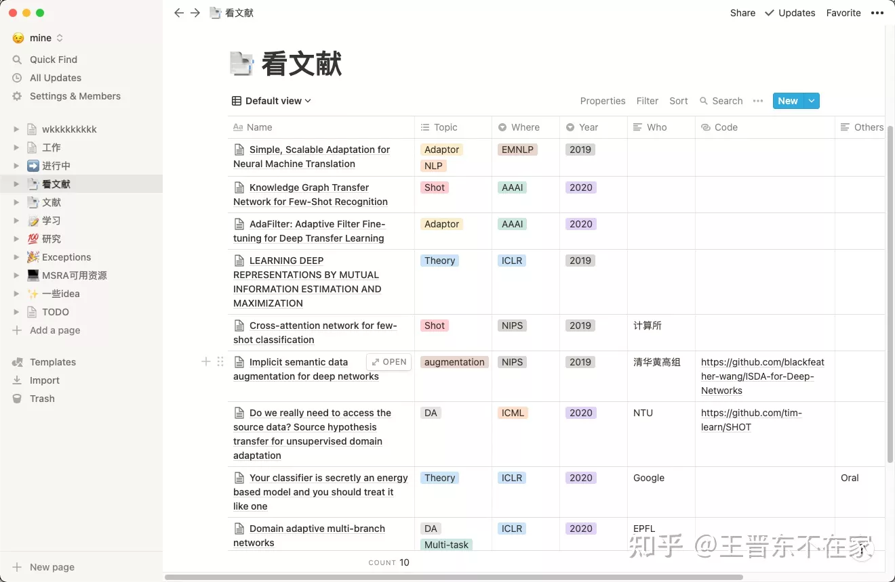
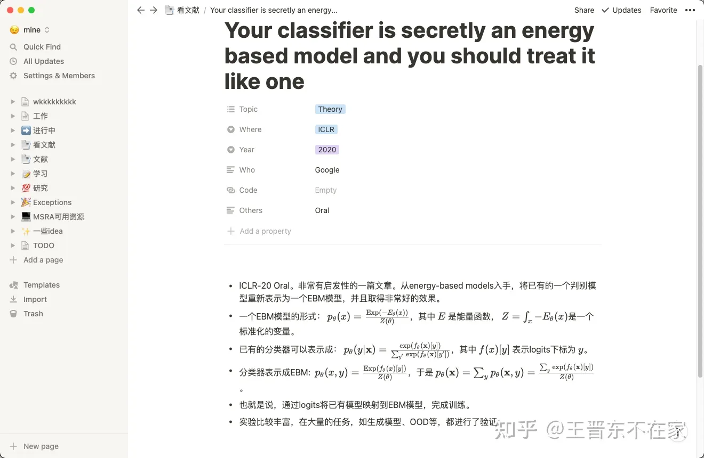
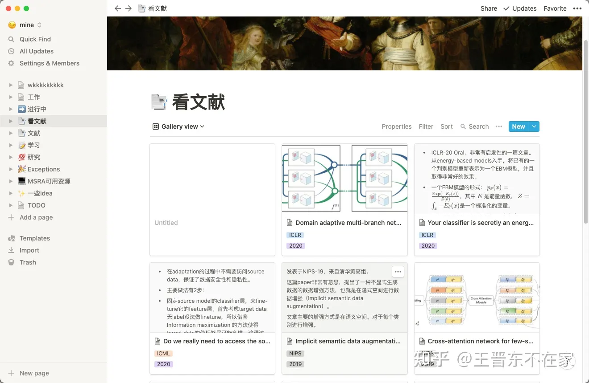

# ResearchGo:研究生活第十帖——可能是最好用的论文笔记管理软件：Notion

之前的文章分享了一些阅读和管理文献的软件，例如[“研究生活”系列精编版之二：文献检索、下载、管理的常用工具](https://zhuanlan.zhihu.com/p/22323250)等等。我们用Zotero等软件，可以很方便地进行文献的管理和查找。例如，我觉得zotero最好用的几个功能：**网盘同步、标签化管理、一键下载论文**，均给我的研究生活带来了便捷。

尤其是**“标签化管理”**这个功能，非常实用。这个功能可以干什么？

## 标签化管理

我们知道，在归类一篇文章时，按照*不同的研究领域、不同的会议或期刊、不同的研究组*等偏好，一篇文章便会属于不同的归类体系。常用的建立文件夹的方式则难以完成这个需求。而一篇文章也可能属于多个研究领域。

例如，来自Facebook的论文《wav2vec 2.0: A Framework for Self-Supervised Learning of Speech Representations》在研究领域上便同时隶属于“预训练”、“语音识别”、“自监督”等至少三个领域。以文件夹为主的管理方式显然无法满足要求。

更重要的是，如果我们有了海量文献（例如笔者的zotero里共有3700篇论文），则**查找**便成为了最重要和头疼的事。我想查找发表在ICML上所有的“预训练”的文章，怎么查？

此时，zotero的标签功能便发挥了它的作用：只需要自己建立好标签，然后将属于这个标签的文章拖动到上面便可完成。这样，一篇文章可以拖动到多个标签上。在查找时，只需要点击相应的标签，便可完成标签化管理，甚至可以点击多个标签，筛选同时隶属于多个标签的文章。

## Zotero无法满足笔记管理需求

然而，Zotero的强项是管理文献。其笔记系统使用非常不方便，而且不支持Markdown和LaTex，十分不友好。

想要愉快地管理笔记，该如何是好？

首先声明：不支持Markdown和Latex的软件首先排除。因此，OneNote和Excel出局。其他软件上，没找到标签的功能。绝大多数都是给页面加标签，并不方便管理。

## Notion：你值得拥有

先来科普一下：Notion是一个国外的笔记软件，最近一两年开始流行起来。其最大创新之处是由Block作为笔记的基本模块，所有内容都能在Block中完成。Notion在B站、知乎等自媒体上有大量的介绍，足见其优秀之处。

PS：学生用户（有edu邮箱即可）可以免费使用其高级版。普通用户则可以使用基础版。

Notion杀手级的功能便是它的**"数据库"**系统。我们也正是利用这个功能，完成对论文笔记的更好管理。

下图是我的电脑上使用Notion进行文献管理的截图（只需要点击按钮建立一个Table即可）。

可以清晰地看到，我按照研究主题、发表年限、发表会议、研究组、有无代码、备注等，设计了一个表格。

其中，“研究主题”是一个**多选框**，完美对应了一篇文章可能有**多个主题**的要求。发表会议则是一个单选框。

其中，每个文章都可以点击Open按钮打开，便可看到对此文章作的笔记：

怎么样，是不是很清爽？你可能看到了，Notion支持LaTex，对我们理工科非常之友好。

有了这个管理系统，你可以通过界面上的**“Filter”**按钮进行过滤选择，选择出你想要的文章来。

是不是很方便？

你可能还会问：笔记还要点开才能看，不好用。那么，向你介绍Notion的**“视图”**功能：

默认视图是表格，你可以点击界面，让其自动添加一种视图。例如，我添加了一个Gallary view的试图，让表格里的内容呈现卡片式排列。这样我便能轻松浏览所有内容。如下图所示：

怎么样，看起来方便多了吧？

Notion的每个页面都是可以分享的。因此，可以把你的笔记分享给你的小伙伴，共同进步。

有想使用我建立的这个模板的同学，请看这里：[Notion – The all-in-one workspace for your notes, tasks, wikis, and databases.](https://link.zhihu.com/?target=https%3A//www.notion.so/jd92wang/43edaf2125ba4bd8aac10ff8ed1e98a5%3Fv%3D6b9abaf7b5e045ad90d96e69f18507c4)。

## 后记

本文便是在Notion上写的。国内也有一款模仿Notion的软件，叫做“我来”，与Notion高度相似，对中文更友好。然而，“我来”目前并没有包含Notion的数据库功能，因此遗憾落选。

Notion的功能之强大远不止于此。事实上你可以用Notion来**管理阅读笔记、作计划、追踪任务、写日记、写博客、行程规划、写简历、制作团队Wiki**等。不过比起这些功能来，我们介绍的标签化管理，才是我决定使用Notion的唯一原因。

Notion官网：www.notion.so （需要科学上网），支持Win/MAC/iOS/安卓全平台。另外，其还有一个Chrome剪贴插件，帮助你将网页内容保存到Notion中。

关于Notion的其他内容，请移步知乎和B站进行搜索学习。

希望Notion可以帮到你的科研！

