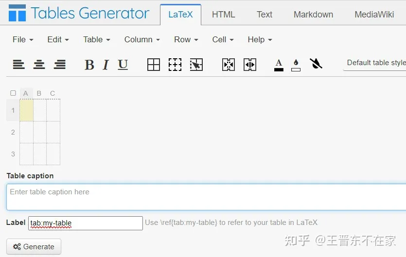
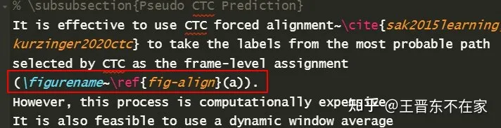
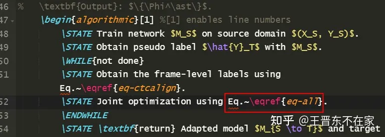
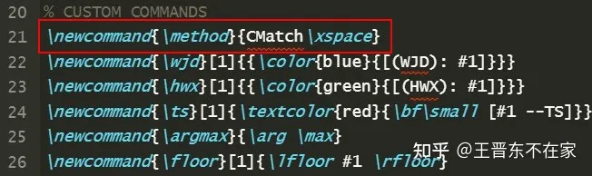
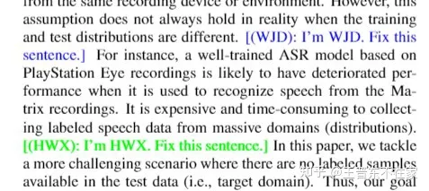
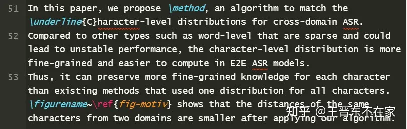
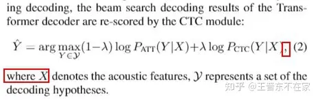

# ResearchGo: 研究生活第11帖——教师节快乐：用LaTex写论文经验分享

这是《ResearchGo》系列的第11篇文章。**LaTex**是学术研究必备的工具，用LaTex写英文论文是研究生必经的阶段，如ICML、NeurIPS等顶会更是只接收用LaTex写的论文。本文根据笔者多年使用LaTex写作学术论文的经验，介绍一些小技巧，希望能帮到正在写论文的你。

我们在本文的最后将会提供一个包含了所有经验的样例论文，读者可以直接下载使用。当然，每个人都有不同的使用工具的习惯，本文介绍的经验仅供参考。

**大纲：**

\- 写作平台的选择
\- LaTex表格
\- 引用表格、图片、公式
\- 方法缩写命名
\- 多人批注
\- 写正文的习惯
\- 写公式的习惯

## 写作平台的选择

当下是一个崇尚**快速启动、团结协作**的时代，因此，仅就英文论文而言，因其并不涉及字体等问题，故传统的基于本地安装Tex环境、安装Tex软件(如TexStudio、VSCode等)的方式变得越来越臃肿和不便了：安装Tex环境需要很久的时间，而且并不利于同步、多人协作等。

相信大多数人已对这个平台不陌生：**Overleaf**。对，这是个在线编写LaTex的网站，支持账号同步、多人共享等。其实它对中文支持也挺好的，**笔者的**[《迁移学习导论》](https://zhuanlan.zhihu.com/p/374927278)**就是在Overleaf上写的。**

地址：[overleaf.com](https://link.zhihu.com/?target=https%3A//www.overleaf.com/project)。

## LaTex表格

LaTex并不是所见即所得，因此，其表格的制作颇为繁琐，尤其是涉及到调格式、增加内容等，非常不便。

我们推荐一个多年使用的平台：**tablesgenerator**，所见即所得，可以**一键转换成LaTex、markdown、HTML等形式的表格**，非常方便！你可以把你的实验结果记录在**excel**上，然后直接复制到这个平台上来，非常方便！

地址：[https://www.tablesgenerator.com/](https://link.zhihu.com/?target=https%3A//www.tablesgenerator.com/)

## 引用表格、图片、公式 

- 引用表格、图片：不要用`Table~\ref{tb}`、`Figure~\ref{fig}`的格式啦！为啥，因为不同模板的table和figure不一样啊，比如有的模板里面的table是TABLE，有的图片是Fig.，这样你就很不方便。有没有自适应的生成名字的形式呢？请用`\tablename~\ref{tb}`、`\figurename~\ref{fig}`！此命令会根据你当下使用的模板，自动生成该模板对应的table和figure的正确名字！
- 引用公式时，也可以用`Eq.~\eqref{xxx}`的形式。注意这个`\eqref`，它直接帮你把公式编号加上括号了，你在引用时就直接看到`Eq. (1)`而不是`Eq. 1`这种不规范的格式。

## 方法缩写命名

通常我们会说，本文提出一个叫做ABC的方法，解决了啥问题。在后文中会有无数次用到这个ABC。如果你突发奇想，想到一个更好的名字要怎么办？**一个一个替换很繁琐，查找-替换又担心误伤其他内容。**

此时，你可以通过使用LaTex的**宏定义**，自己定义一个名字！比如，你的方法叫ABC，你担心后面会换名字，那么，可以将其定义成一个宏：在document前面加一个命令：`\newcommand{\method}{ABC\xspace}`，这样，以后你再用ABC的时候，就可以直接写`\method`，不信你试试，是不是特别方便？（注意，要再加一个xspace包，不然会编译不过）

此外，也有人习惯用宏定义定义一些公式等，我个人觉得这种通用性并不好，所以不推荐使用。

## 多人批注

多人批注容易乱？没问题，再来一个宏定义帮你搞定！

比如小王的批注：`\newcommand{\wjd}[1]{{\color{blue}{[(WJD): #1]}}}`

比如小李的批注：`\newcommand{\li}[1]{{\color{red}{[(Li): #1]}}}`

这样，小王在批注的时候可以直接用`\wjd{xxx}`的形式，而且显示是蓝色；小李则用`\li{xxx}`，显示红色，一点不会乱！

## 写正文的习惯

正文通常由一大段一大段的文字组成。我们建议是，写LaTex正文的时候，不要写成一段一行的形式，而是**一句话一行、空行表示段落间隔**。

为什么这样呢？因为你的一行里面可能包含有公式，而当你有许多行里都有公式时，如果你写成一行一段的形式，一个公式出错的时候，你看到的错误信息是，这一大行都错了，根本不知道哪个公式错了，给调试带来困扰。而一行一句则可以很好地避免这一现象。

另外，建议写作时要适当空行，`\section`等，都可以换行，不影响内容，反而让你的正文看起来更清爽一些。

## 写公式的习惯

一般来说，行间公式后如果有`where a = xxx`的形式，那么此公式需要在末尾写一个**逗号**；如果此公式就是完成了，则公式后用一个**点**。然后空一行开始新一段落的内容。

**最后，送上一份包含了所有例子的文档：**[Overleaf, Online LaTeX Editor](https://link.zhihu.com/?target=https%3A//www.overleaf.com/read/kygtyxjkxhcs)

你可以直接打开、下载、复制它，用于你的项目！希望这些经验可以帮助到你的科研！